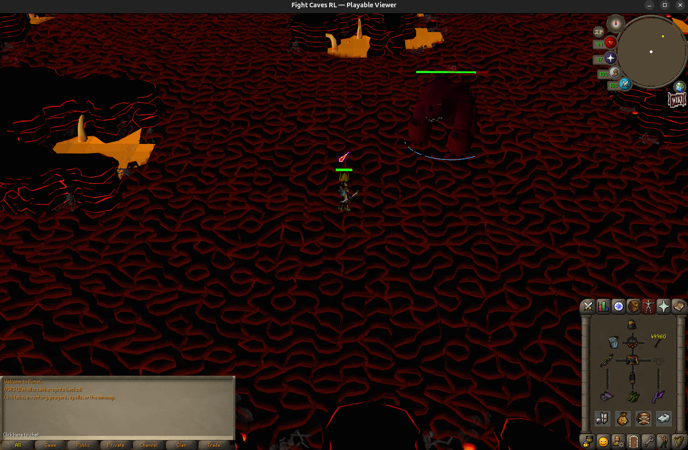
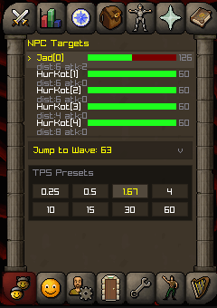
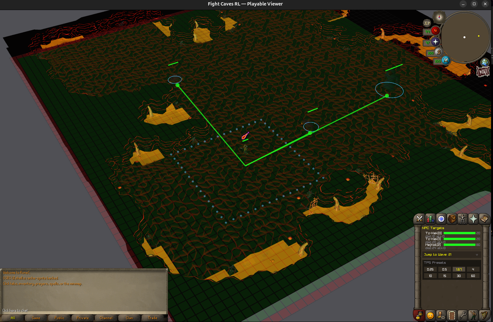
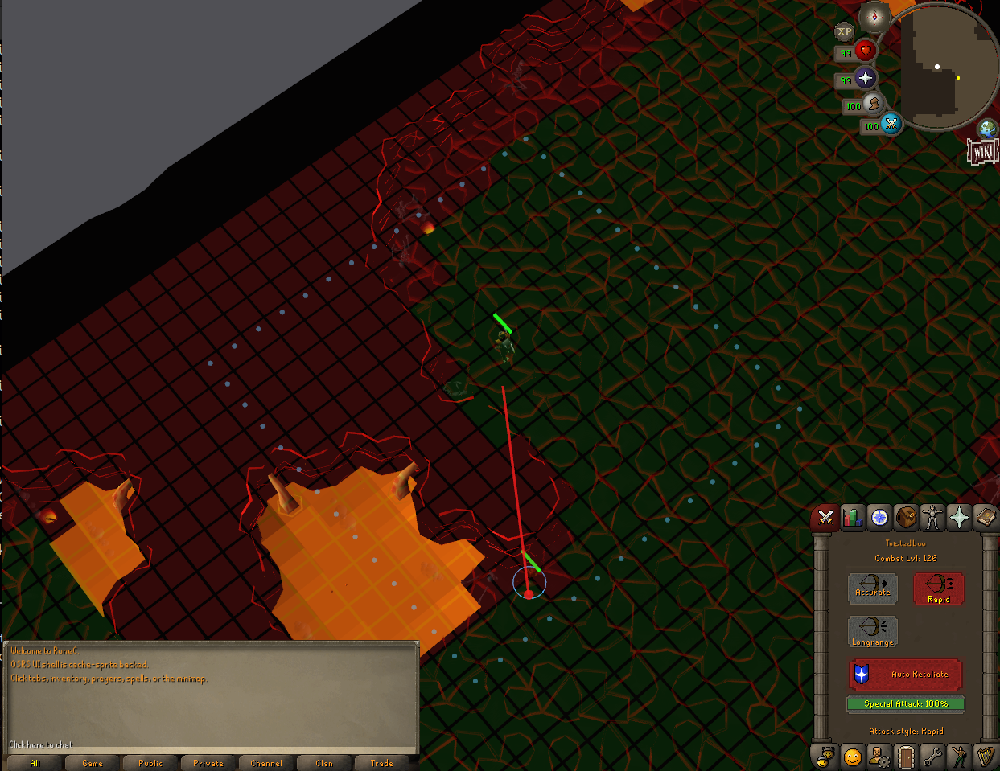
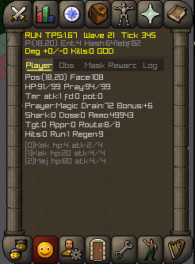
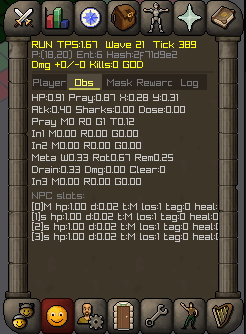
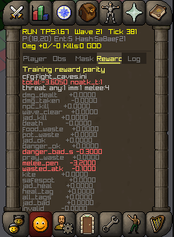
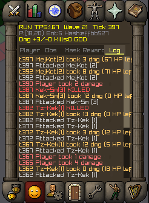

# Fight Caves RL

Training a reinforcement learning agent to complete the Old School RuneScape Fight Caves — a 63-wave PvM gauntlet ending in a boss fight against TzTok-Jad.

**Goals:**
- Build a deterministic, high-performance Fight Caves simulation in C
- Train a PPO agent from scratch to clear all 63 waves and defeat Jad
- Achieve this without human demonstrations or hardcoded strategies

**Current results (v35.1 — `gacjanj0` / sweet-plant-580):**
- Agent reaches wave 63 (Jad) on **~99% of episodes** from cold start
- Learned safespotting, prayer switching, kiting, and resource management
- **Jad kill rate: 94.9% peak, sustained 90%+ band between 1.1B–1.6B steps** — the agent
  reliably wins the Fight Caves from a cold-start PPO run
- v35.1 reproduces hparams from `a3mi6u2g`, the top pick of the v34 long Protein sweep
  (200 trials over PPO/optimizer/policy knobs on v32.0 baseline)
- Cold-start training: ~26 min for 3B steps on RTX 5070 Ti (~1.9M SPS)

**Recent diagnostics:**
- **v35 (`8z4lqldl`)** — same SOTA config with corrected Jad healer respawn behavior;
  peak `jad_kill_rate=96.5%`, best saved checkpoint `90.6%`
- **v36 (`jta3lkgx`)** — no-consumables diagnostic with `initial_sharks=0` and
  `initial_prayer_doses=0`; same action heads/masks, peak `jad_kill_rate=80.8%`,
  best saved checkpoint `69.1%`


---

## Getting Started

### Requirements

- Linux (tested on Ubuntu 24.04)
- Python 3.12+
- NVIDIA GPU with CUDA 12.8+ and cuDNN 9+
- CMake 3.20+
- GCC/G++
- Raylib 5.5 (vendored in `demo-env/raylib/`)

### Clone & Setup

```bash
git clone https://github.com/jordanbailey00/FightCaves-RL.git
cd FightCaves-RL/runescape-rl

# Create virtual environment
python3 -m venv .venv
source .venv/bin/activate

# Install dependencies
pip install torch numpy wandb pybind11 rich rich-argparse
```

### Play (Viewer)

Build and launch the interactive Raylib viewer:

```bash
cmake -B build -DCMAKE_BUILD_TYPE=Release
cmake --build build -j$(nproc)
./build/demo-env/fc_viewer
```

From the repo root checkout, the viewer path is:

```bash
./runescape-rl/build/demo-env/fc_viewer
```

The viewer uses the same `fc-core` backend as training, with cache-derived Fight Caves terrain,
objects, models, animations, spotanims, projectile visuals, sprites, minimap, and OSRS-style side
tabs.



The clan chat tab is repurposed for viewer controls: clickable NPC targets, a wave selector, and
manual TPS presets. The friends tab holds the debug dashboard when `D`/`O` is enabled, while the
normal prayer tab remains clickable for Protect from Melee, Missiles, and Magic.

<p>
  
  
</p>

Debug rendering can show walkable tiles in green, blocked tiles in red, NPC line-of-sight rays, path
routes, and the player ranged perimeter. These overlays are visual diagnostics only; gameplay still
comes from `fc-core`.

<p>
  
  
  
  
</p>

The side diagnostics expose player state, observation slots, masks, policy reward components, and an
event log so policy behavior can be inspected while playing or replaying a checkpoint.

Hotkeys:
- Left click arena/minimap — route movement; click an NPC or target row to attack
- `1` / `2` / `3` — toggle Protect from Melee / Missiles / Magic
- `F` — eat shark; `P` — drink prayer potion; `X` — toggle run
- `Space` — pause/resume; `Right Arrow` — single tick; `R` — reset episode
- `D` or `O` — toggle debug overlay and open the friends diagnostics tab
- `Shift+O` — cycle debug overlay groups
- `G` — grid; `C` — collision overlay
- `4` / `5` — camera presets; `L` — lock/unlock camera follow
- Right-drag — orbit camera; scroll — zoom; `Q` / `Esc` — quit

### Train

Run a full training session (cold start, ~26 min for 3B steps on RTX 5070 Ti):

```bash
FORCE_BACKEND_REBUILD=1 bash train.sh
```

`train.sh` handles venv activation, config sync, backend compilation, and launch. Training logs to W&B by default.

Key flags:
```bash
bash train.sh --no-wandb                                # disable W&B logging
bash train.sh sweep                                      # run Protein hparam sweep
WANDB_TAG=v30.0 bash train.sh                            # tag the run in W&B
CONFIG_PATH=/path/to/custom.ini bash train.sh            # override config
LOAD_MODEL_PATH=/path/to/checkpoint.bin bash train.sh    # warm-start
```

### Evaluate a Checkpoint

Watch a trained policy play in the viewer:

```bash
source .venv/bin/activate
python3 demo-env/eval_viewer.py --ckpt /path/to/checkpoint.bin
```

---

## Commands

| Command | Description |
|---------|-------------|
| `bash train.sh` | Train with current config (cold start) |
| `bash train.sh sweep` | Run Protein hyperparameter sweep |
| `bash train.sh --no-wandb` | Train without W&B logging |
| `LOAD_MODEL_PATH=<path> bash train.sh` | Warm-start from checkpoint |
| `./build/demo-env/fc_viewer` | Launch playable viewer |
| `python3 demo-env/eval_viewer.py --ckpt <path>` | Replay trained policy |
| `bash analyze_run.sh <run_id>` | Quick W&B run analysis |

---

## Architecture

<!-- TODO: Simple block diagram showing fc-core -> training-env -> PufferLib and fc-core -> demo-env -> Raylib -->

```
runescape-rl/
├── fc-core/           Deterministic C game simulation
│   ├── include/       Headers (types, contracts, combat, reward, API)
│   └── src/           Implementation (tick, state, combat, NPC, wave, prayer)
├── training-env/      PufferLib 4.0 adapter (binding.c, fight_caves.h)
├── demo-env/          Raylib 3D viewer + eval tooling
│   ├── src/           Viewer, debug overlay, asset loaders
│   └── assets/        Collision map, prayer/item sprites
├── config/            Training config (fight_caves.ini)
└── docs/              Run history, RL config reference, design doc
```

**Backend (`fc-core/`):** Pure C, zero allocations per tick. Deterministic game simulation — combat, pathfinding, prayer, waves, NPC AI. Both the viewer and trainer call into the same `fc_step()` function.

**Training (`training-env/`):** PufferLib 4.0 wrapper. Compiles the C backend into a shared library with CUDA-accelerated vectorized environments. 4096 parallel agents, ~2M steps/sec on a single GPU.

**Viewer (`demo-env/`):** Raylib-based 3D viewer for human play and policy replay. Debug overlay shows reward breakdown, NPC stats, prayer state, threat context.

**Training stack:** PPO with MinGRU policy (2-layer, 256 hidden, ~439K params). W&B integration for logging and sweep analysis.

---

## RL Config

Current live config is the v36 no-consumables diagnostic: v35.1/v34 top-pick hparams with
`initial_sharks=0` and `initial_prayer_doses=0`. Restoring full supplies means setting those two
keys back to `20` and `32`.

Base recipe (v35.1 — v32.0 reward baseline + v34 sweep top-pick hparams):

| Category | Key params |
|----------|-----------|
| **Combat rewards** | `w_damage_dealt=0.9`, `w_npc_kill=3.5`, `w_wave_clear=15.0`, `w_jad_kill=2000.0` |
| **Survival penalties** | `w_damage_taken=-1.9` (squared, 70x amplified), `w_player_death=-11.0` |
| **Prayer shaping** | `w_correct_danger_prayer=0.25`, `w_correct_jad_prayer=1.5`, `shape_wrong_prayer_penalty=-0.3`, `shape_unnecessary_prayer_penalty=-0.2` |
| **Positioning** | `shape_npc_melee_penalty=-0.8`, `shape_safespot_attack_reward=1.5`, `shape_kiting_reward=2.2` (band 2-10) |
| **Resource management** | `shape_food_waste_scale=-1.2`, `shape_pot_waste_scale=-1.2` (proportional waste only) |
| **Wave-stall pressure** | `shape_wave_stall_start=1400`, `shape_wave_stall_base_penalty=-0.5`, `shape_wave_stall_cap=-2.0` |
| **Procedural penalties** | `w_invalid_action=-0.1`, `w_tick_penalty=-0.005`, `shape_wasted_attack_penalty=-0.1`, `shape_jad_heal_penalty=-0.3` |
| **PPO (swept)** | `lr=9e-4`, `gamma=0.9963`, `gae_lambda=0.9641`, `ent_coef=0.0242`, `clip_coef=0.178`, `vf_coef=1.0`, `max_grad_norm=0.25` |
| **VTrace / prio replay (swept)** | `replay_ratio=1.568`, `vtrace_rho_clip=0.5`, `vtrace_c_clip=0.504`, `prio_alpha=0.968` |
| **Adam (swept)** | `beta1=0.95`, `beta2=0.9996`, `eps=1e-10` |
| **Schedule** | `horizon=256`, `minibatch=4096`, `total_timesteps=3B`, `anneal_lr=off` |
| **Policy** | MinGRU, 3 layers, 256 hidden |
| **Vector** | `4096 agents`, `2 buffers` |

Full config: [`runescape-rl/config/fight_caves.ini`](runescape-rl/config/fight_caves.ini).

---

## Results

### Current SOTA: v35.1 (`gacjanj0` / sweet-plant-580)

v35.1 reproduces the hparams from `a3mi6u2g`, the top pick from the v34 long Protein sweep
(200 trials over PPO/optimizer/policy knobs on the v32.0 reward baseline). Cold-start reproduction beat the original sweep result.

| Metric | v32.0 (prior SOTA) | v34 sweep best (`a3mi6u2g`) | **v35.1 (current SOTA, `gacjanj0`)** |
|---|---:|---:|---:|
| peak `jad_kill_rate` | 0.810 | 0.886 | **0.949** |
| peak step | 1.98B | 2.03B | **1.215B** |
| top-10 cluster | — | 0.85–0.89 | **0.90–0.95** (steps 1.10B–1.62B) |
| peak `wave_reached` (avg over rollouts) | 62.7 | 63.0 | **62.92** |
| training time | 26 min | ~26 min | ~26 min (3B steps) |
| throughput | 1.92M SPS | ~1.9M SPS | ~1.9M SPS |

The v35.1 config holds the v32.0 reward shaping unchanged and swaps in only the PPO/optimizer/policy hparams the sweep found:
`lr=9e-4` (3x the v32 default), `gamma=0.9963`, `ent_coef=0.024`, `vf_coef=1.0`, `replay_ratio=1.57`, `prio_alpha=0.97`, 3-layer MinGRU.

### Key Milestones

- **v21.2** — First cold start to reach wave 60 (range-7 weapon, no LOS)
- **v22.1** — First Jad kills (1.5%, warm-started), introduced TBow combat model
- **v25.9** — First cold start under TBow+LOS to reach wave 60+
- **v28.4** — 20–50% Jad kill rate at 3.5B budget
- **v28.8** — 59.1% peak Jad kill rate (prior reward-shape SOTA)
- **v29.1** — `prio_alpha=0` ablation: 33% compute reduction at same-or-better deployment quality
- **v30.0** — v28.8 baseline with dead `*_full_waste_penalty` keys removed; verified byte-identical
- **v32.0** — Added `shape_jad_heal_penalty=-0.3`: peak jad kill 0.810 (+15.4% over obs.1 prior SOTA)
- **v34 sweep** — 200-trial Protein sweep on v32.0 baseline; identified PPO/optimizer recipe that lifted peak by another ~8.5%
- **v35.1** — Cold-start reproduction of v34's top pick (`a3mi6u2g`); **peak jad kill rate 94.9% — current SOTA**
- **v36** — No-consumables diagnostic (`jta3lkgx`): `initial_sharks=0`, `initial_prayer_doses=0`, same action heads/masks; peak Jad kill rate 80.8%

### Hparam Recipe (from the v34 sweep)

Across the top 7 stable runs in the sweep, several knobs pinned at the same values (likely correct defaults — drop from future sweeps): `hidden_size=256`, `total_agents=4096`, `horizon=256`, `minibatch_size=4096`. The variable knobs Protein wanted to push:

| Hparam | v32.0 baseline | Top picks |
|---|---:|---:|
| `learning_rate` | 3e-4 | **9e-4** (6 of 7), 7.75e-4 (1 of 7) — pinned at sweep upper bound |
| `gamma` | 0.999 | 0.9900–0.9963 — all picks **below** v32 |
| `replay_ratio` | 1.0 | 1.44–1.60 — well above default |
| `ent_coef` | 0.01 | 0.0153–0.0300 |
| `num_layers` | 2 | 3 (5 of 7), 2 (2 of 7) — 3-layer dominates |

---

## Project Status

The Fight Caves agent now clears Jad at ~95% peak. Active focus is post-sweep analysis: identify whether the late-training degradation (peak at 1.2B, drop to ~0.62 by 3B with lr=9e-4) is fixable with a lr schedule or an earlier-stop policy, and run a follow-up sweep with the pinned knobs dropped.

---

## License

MIT License. See [LICENSE](../LICENSE) for details.
